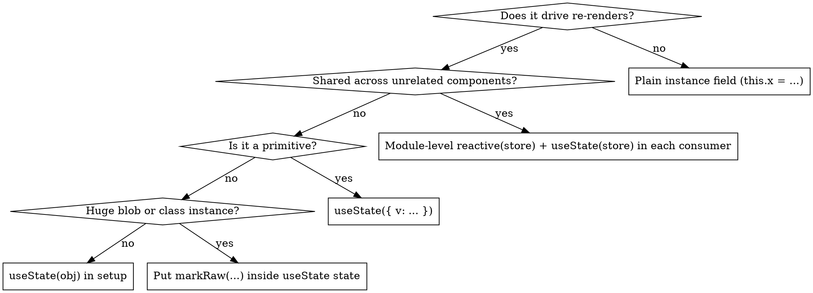

# OWL 2.x Skill

OWL (Odoo Web Library) is the component framework that powers Odoo's web client. Odoo 19 ships **OWL 2.8.2** (verified by inspecting `addons/web/static/lib/owl/owl.js` on the `19.0` branch: `const version = "2.8.2";`, hash `52abf8d`). All content in this skill is taken from the `owl-2.x` branch of the official repository and from Odoo 19's official documentation. Every claim can be verified against the URLs in the provenance section at the bottom of this file.

This skill focuses on **OWL itself** — the component/template/reactivity library — not on Odoo's wider JS framework (services, registries, views). Odoo-specific OWL usage lives in `references/12_odoo_appendix.md`.

## Critical version warning — do not confuse OWL 2 with OWL 3

The GitHub **`master` branch is OWL 3 alpha** (signals, `computed`, `proxy`, `effect`, `t-out` only, no `t-esc`, no `onWillUpdateProps`, no `onWillRender`/`onRendered`, new plugin system). **Do not use OWL 3 documentation or APIs for Odoo 14–19.** The stable, currently-shipped line is on the **`owl-2.x`** branch. When fetching official docs, always use:

```
https://raw.githubusercontent.com/odoo/owl/owl-2.x/doc/...
```

If code uses `signal()`, `computed()`, `effect()`, `signal.Array(...)`, `signal.Map(...)`, plugins, or `useApp()`, that is OWL 3. In OWL 2 the primitives are `reactive`, `useState`, `markRaw`, `toRaw`, lifecycle `on…` hooks.

## How to use this skill

Load the reference file that matches the current task. Do not read every file upfront.

| If the task is about… | Read |
|---|---|
| Writing a component from scratch, lifecycle, `setup`, sub-components, dynamic components, `status` | `references/01_component_lifecycle.md` |
| State, `useState`, `reactive`, re-render rules, stores, `markRaw`, `Map`/`Set` | `references/02_reactivity.md` |
| QWeb directives, `t-if`, `t-foreach`, `t-key`, `t-att`, `t-esc` vs `t-out`, SVG, fragments, `xml` | `references/03_templates.md` |
| Built-in hooks, the hook rule, custom hooks, `useEffect`, `useSubEnv` | `references/04_hooks.md` |
| Props declaration, validation, `.bind`/`.alike`/`.translate`, `t-props`, `defaultProps` | `references/05_props.md` |
| Slots, named slots, default slot, `t-slot-scope`, slot props, dynamic slots | `references/06_slots.md` |
| `useRef`/`t-ref`, `t-on-*`, event modifiers including the `.synthetic` perf modifier | `references/07_refs_events.md` |
| Rendering pipeline: Fiber, scheduler, two-phase render, async rendering, `render(deep)` | `references/08_concurrency_rendering.md` |
| Performance: avoiding re-renders, shallow prop check, reactive-prop reobservation, `markRaw`, synthetic events, `batched` | `references/09_performance.md` |
| `onError`, error boundary pattern, testing components | `references/10_errors_testing.md` |
| `App`, `mount`, configuration, dev mode, template loading, precompilation | `references/11_app_mount.md` |
| Odoo 19 specifics: env, services, registries, `useService`, template naming | `references/12_odoo_appendix.md` |

Runnable example snippets — all verbatim from the official docs or tutorials — live under `examples/`. Load them when building something that matches:

| Building… | Read |
|---|---|
| A minimal component to sanity-check your setup | `examples/counter.md` |
| A module-level `reactive` store shared across components | `examples/store.md` |
| A custom hook (e.g., `useAutofocus`, `useInterval`) | `examples/custom_hooks.md` |
| An error boundary with a fallback slot | `examples/error_boundary.md` |
| A long list that scrolls smoothly (`markRaw`, `.synthetic`, keys) | `examples/large_list_optimization.md` |
| A container with named/scoped slots (tabs, notebook, cards) | `examples/slots_notebook.md` |

Every explicit anti-pattern called out by the official docs is consolidated in `antipatterns.md`. Read it after finishing any non-trivial OWL work as a final review pass.

## At a glance — the 10 rules in one line each

Read this block first; jump to the detailed rules below only when you need the why or a citation.

1. Component = class extending `Component` + `setup()` + `static template`. Never override `constructor`.
2. `render()` is async and batched to the next animation frame — tests need `await nextTick()`.
3. Parent re-renders do NOT cascade to children unless a prop's reference changed (shallow equality).
4. Reactivity is proxy-based and **ephemeral**: unread keys don't trigger re-renders; subscriptions reset every render.
5. Every `t-foreach` needs a `t-key` that is a unique string or number (never an object, avoid raw index).
6. All hooks (`useState`, `useRef`, `on*`, `useEffect`) must be called in `setup()` or class-field initialisers.
7. Callback props: `.bind="method"` for methods, `.alike="() => ..."` for stable lambdas — bare arrows churn the tree.
8. `t-on-*` handlers are functions only (no expressions); add `.synthetic` for huge lists.
9. Render/lifecycle errors destroy the whole app unless caught by `onError`; event-handler errors are your own.
10. Props are read-only for the child; to mutate parent state, pass a callback prop.

## Red flags — stop and re-check

If you catch yourself thinking any of these, you're about to violate a rule. Re-read the matching rule before shipping.

| Thought | What's actually happening |
|---|---|
| "The list is small, I'll skip `t-key` / use the index" | On insert/reorder, focus, selection, scroll and animation state attach to the wrong row. Use an intrinsic id. |
| "I'll `useState(false)` for this flag" | Returns a Proxy of a Boolean — not reactive. Wrap in `{}`: `useState({ flag: false })`. |
| "I need async data first, so I'll declare state in `willStart`" | Hooks must run in `setup()`. Declare state in `setup`, load the data in `onWillStart`. |
| "It's just one callback prop, a lambda is fine" | Fresh reference every parent render → child re-renders every time. Use `.bind` or `.alike`. |
| "I'll mutate the `markRaw` object in place, it's faster" | OWL doesn't see the change → no re-render. Replace the entry with a fresh `markRaw({...})`. |
| "I'll read `ref.el` in `setup` to pre-focus" | `.el` is null before mount. Move it into `onMounted` / `onPatched` / an event handler. |
| "Signals look cleaner — let me use `signal()` / `computed()` / `effect()`" | That's OWL 3 alpha. Odoo 14–19 ships OWL 2.x — stick to `reactive` + `useState`. |
| "I'll `t-ref` this `<Child/>` and call methods on it" | `t-ref` is DOM-only. Lift state up or pass a callback prop. |
| "I'll `markRaw` everything for perf" | Silently breaks reactivity. Only after profiling reveals reactive overhead is the bottleneck. |
| "I'll `t-on-click="state.count + 1"`" | Expressions aren't allowed anymore — pass a function: `t-on-click="() => state.count++"`. |
| "I'll `t-att-disabled="false"` to keep the attribute as `'false'`" | Falsy → attribute is omitted. Use `t-att-disabled="'false'"` or `t-attf-disabled="false"` if you really want the string. |
| "I'll set `dev: true` in the prod build for nicer errors" | Costs real performance. Gate on a build-time flag. |

## Core mental model (the 10 things to remember)

These ten statements are the minimum you need in working memory when writing OWL. Each is grounded in the official docs; deeper treatment lives in the reference files cited.

### 1. A component is a class with a `setup()` and a `static template`

OWL has no function components. A component is an ES-class extending `Component`, registers sub-components in `static components`, declares its template name (or inline with the `xml` tagged-template) in `static template`, and initialises state and hooks in `setup()` (or in class fields). Never override `constructor` — the Odoo docs state explicitly: _"components should use the `setup` method"_ ([owl_components.html](https://www.odoo.com/documentation/19.0/developer/reference/frontend/owl_components.html)). Full details and lifecycle hooks in `references/01_component_lifecycle.md`.

```js
import { Component, useState, xml } from "@odoo/owl";

class Counter extends Component {
  static template = xml`
    <button t-on-click="increment">
      Click [<t t-esc="state.value"/>]
    </button>`;

  setup() {
    this.state = useState({ value: 0 });
  }

  increment() {
    this.state.value++;
  }
}
```

### 2. Rendering is asynchronous and batched to the next animation frame

A `render()` call schedules work — it does **not** update the DOM synchronously. The concurrency doc says: _"Owl uses it to only apply the result of many different renderings only once in an animation frame. Owl can cancel a rendering that is no longer relevant, restart it, reuse it in some cases."_ ([concurrency_model.md](https://raw.githubusercontent.com/odoo/owl/owl-2.x/doc/reference/concurrency_model.md)). A single logical render has two phases: a recursive async _virtual rendering_ phase, and a synchronous _patching_ phase that lands on the next animation frame. Details in `references/08_concurrency_rendering.md`.

Implications: in tests, you `await nextTick()` (a `setTimeout` + a `requestAnimationFrame`) before asserting on the DOM ([how_to_test.md](https://raw.githubusercontent.com/odoo/owl/owl-2.x/doc/learning/how_to_test.md)). `render()` no longer returns a promise (this is a change from OWL 1.x — see `CHANGELOG.md`).

### 3. Parent renders do NOT cascade into children unless props actually changed

_"Since version 2.0, Owl renders are no longer 'deep' by default: a component is only rerendered by its parent if its props have changed (using a simple equality test)."_ ([reactivity.md](https://raw.githubusercontent.com/odoo/owl/owl-2.x/doc/reference/reactivity.md)). The check is a shallow referential comparison of each prop ([props.md](https://raw.githubusercontent.com/odoo/owl/owl-2.x/doc/reference/props.md)). If you want a parent's `render()` to recurse unconditionally, pass `deep: true` — and the doc is pedantic: _"the value of the `deep` argument needs to be a boolean, not a truthy value."_ ([component.md](https://raw.githubusercontent.com/odoo/owl/owl-2.x/doc/reference/component.md)).

This has a direct performance consequence on **function props**: an anonymous lambda passed to a child will be a new reference on every render, forcing the child to re-render. Use `.bind` (for methods) or `.alike` (for safe lambdas) — see Rule 7 below and `references/09_performance.md`.

### 4. Reactivity is proxy-based and _ephemeral_

`useState(obj)` (for objects/arrays) and `reactive(obj, cb?)` wrap the object in a Proxy. Reading a property through the proxy _subscribes_ the current observer (the component's render function, or the explicit callback) to that property; writing it _notifies_ observers. OWL's docs are explicit about the ephemeral rule: _"whenever an observer is notified that a state object has changed, all of its subscriptions are cleared, meaning that if it still cares about it, it should read the properties it cares about again."_ ([reactivity.md](https://raw.githubusercontent.com/odoo/owl/owl-2.x/doc/reference/reactivity.md)).

Consequence: _"a component only rerenders when there are changes to pieces of state that have been read during or after the previous render."_ Keys behind an inactive `t-if` branch are **not** subscribed, so writes to them won't cause a re-render until they become read again. Full details, `Map`/`Set` support, `markRaw`, `toRaw`, and store patterns in `references/02_reactivity.md`.

Critical: `useState` only works with **objects or arrays**. A primitive will not be reactive.

### 5. `t-foreach` REQUIRES a `t-key`, and keys must be strings or numbers

_"Owl requires the presence of a `t-key` directive, to be able to properly reconcile renderings. … A key should be a unique number or string (objects will not work: they will be cast to the `\"[object Object]\"` string, which is obviously not unique). If there is no `t-key` directive, Owl will use the index as a default key."_ ([templates.md](https://raw.githubusercontent.com/odoo/owl/owl-2.x/doc/reference/templates.md)).

Using the index as a key defeats virtual-DOM reconciliation when items are inserted/removed — focus, selection, scroll, and animation state get attached to the wrong row. See `references/03_templates.md` and the anti-patterns file.

### 6. Hooks must be called in `setup()` or class-field initialisers, nowhere else

_"every hook for a component has to be called in the `setup` method, or in class fields"_ ([hooks.md](https://raw.githubusercontent.com/odoo/owl/owl-2.x/doc/reference/hooks.md)). Calling `useState` / `useRef` / `onMounted` / etc. from `willStart` or any async handler is wrong — the constructor has already run by then. The lifecycle-hook table and full list of `use*` hooks are in `references/04_hooks.md`.

### 7. `.bind` and `.alike` are how you stop callback props from churning the tree

When you write `onClick="() => doSomething()"` on a child, the lambda is a fresh reference every render, so the shallow equality check from Rule 3 fails and the child re-renders every time. Two official suffixes solve this:

- `callback.bind="methodName"` — passes `this.methodName` bound to the parent; also implies `.alike`.
- `callback.alike="() => foo()"` — tells OWL to treat the lambda as equivalent across renders.

The props doc warns that `.alike` can still produce a stale closure if the lambda captures state that _should_ change — read the warning in `references/05_props.md`.

### 8. Events: prefer `t-on-*` methods; use `.synthetic` for very large lists

`t-on-click="handler"` is the canonical way to bind a DOM event. Handlers must be functions — `t-on` does not accept expressions anymore. Modifiers `.stop`, `.prevent`, `.self`, `.capture`, `.synthetic` are supported and order matters (e.g. `t-on-click.prevent.self` differs from `t-on-click.self.prevent`). The `.synthetic` modifier is a performance feature: OWL adds a single delegated listener on `document.body` instead of one per element. See `references/07_refs_events.md`.

### 9. Errors in rendering destroy the app unless caught by `onError`

_"If an error that occured in the internal rendering cycle is not caught, then Owl will destroy the full application. This is done on purpose, because Owl cannot guarantee that the state is not corrupted from this point on."_ ([error_handling.md](https://raw.githubusercontent.com/odoo/owl/owl-2.x/doc/reference/error_handling.md)). Errors inside event handlers are **not** caught by `onError` — that's up to application code. Build boundaries with `onError` + a fallback slot. Pattern in `references/10_errors_testing.md` and `examples/error_boundary.md`.

### 10. Props are read-only for the child

_"Props should be considered readonly, from the perspective of the child component."_ ([props.md](https://raw.githubusercontent.com/odoo/owl/owl-2.x/doc/reference/props.md)). If a child needs to mutate parent state, the parent passes a callback. Props validation (`static props = {...}` or `static props = [...]`) is only enforced in dev mode; when on, it is a strong safety net — a component that defines `static props` errors on any undeclared prop unless you include the special `"*"` escape. Full validation schema in `references/05_props.md`.

## Decision checklist before writing a component

Use this as a mental pre-flight:

1. **Does the state need to be reactive?** If yes and it is an object/array, wrap it with `useState` in `setup`. If it is a primitive or should not trigger re-renders (e.g. a cached derived value, a DOM ref, a huge immutable matrix), keep it as a plain instance field or wrap with `markRaw`.

2. **Who owns the state?** If one component owns it, use `useState` there and pass pieces as props. If several unrelated components share it, use a module-level `reactive(store)` and call `useState(store)` in each consumer — see `examples/store.md`.

3. **Every `t-foreach`** → pair with a stable `t-key` derived from an intrinsic id. Never `item_index` unless the list is append-only and order-stable and you have read the caveats.

4. **Every sub-component that receives a lambda prop** → use `.bind` or `.alike`, not a bare arrow function. Otherwise the child re-renders on every parent render.

5. **Every `willStart` / `onWillUpdateProps`** → is the work truly async? Minimise async components; the concurrency doc's first tip is literally _"Minimize the use of asynchronous components!"_. Multiple `onWillStart` callbacks run in parallel, not sequentially — useful but sometimes surprising.

6. **Any list longer than a few hundred immutable items** → consider `markRaw` on the items (details in `references/09_performance.md`). Only after profiling.

7. **Any handler attached in many list rows** → consider `.synthetic`.

8. **If you need the DOM**: `useRef("name")` + `t-ref="name"`, read `ref.el` only after the component is mounted. For components, `t-ref` **does not work** — refs point at DOM nodes only.

## Choosing a state mechanism

One of the genuinely non-obvious OWL decisions. Use this flowchart, not instinct.



Rule of thumb: reach for `reactive` + module store only when ≥2 unrelated components need the same data. For a single parent/child tree, `useState` at the parent and props down the tree is simpler and still efficient thanks to the shallow-prop check (rule 3).

## Conventions and naming

The Odoo 19 docs recommend: _"Template names should follow the convention `addon_name.ComponentName`. This prevents name collision between odoo addons."_ ([owl_components.html](https://www.odoo.com/documentation/19.0/developer/reference/frontend/owl_components.html)). Snake-case the filename to match the component name: `TodoList` → `todo_list.js`, `todo_list.xml`, optionally `todo_list.scss`. Inline `xml`\`…\`` templates are fine for prototypes but should be XML files in production because _"inline templates in javascript code … is only useful to get started. In practice, templates in Odoo should be defined in an xml file, so they can be translated."_

## Provenance (every claim in this skill is backed by one of these)

All content below points to the exact files consulted. When in doubt about a claim, re-read the corresponding doc via these URLs.

OWL 2.x reference (canonical — stable branch, not `master`):

- `https://raw.githubusercontent.com/odoo/owl/owl-2.x/README.md`
- `https://raw.githubusercontent.com/odoo/owl/owl-2.x/CHANGELOG.md`
- `https://raw.githubusercontent.com/odoo/owl/owl-2.x/doc/readme.md`
- `https://raw.githubusercontent.com/odoo/owl/owl-2.x/doc/reference/app.md`
- `https://raw.githubusercontent.com/odoo/owl/owl-2.x/doc/reference/component.md`
- `https://raw.githubusercontent.com/odoo/owl/owl-2.x/doc/reference/concurrency_model.md`
- `https://raw.githubusercontent.com/odoo/owl/owl-2.x/doc/reference/environment.md`
- `https://raw.githubusercontent.com/odoo/owl/owl-2.x/doc/reference/error_handling.md`
- `https://raw.githubusercontent.com/odoo/owl/owl-2.x/doc/reference/event_handling.md`
- `https://raw.githubusercontent.com/odoo/owl/owl-2.x/doc/reference/hooks.md`
- `https://raw.githubusercontent.com/odoo/owl/owl-2.x/doc/reference/input_bindings.md`
- `https://raw.githubusercontent.com/odoo/owl/owl-2.x/doc/reference/portal.md`
- `https://raw.githubusercontent.com/odoo/owl/owl-2.x/doc/reference/precompiling_templates.md`
- `https://raw.githubusercontent.com/odoo/owl/owl-2.x/doc/reference/props.md`
- `https://raw.githubusercontent.com/odoo/owl/owl-2.x/doc/reference/reactivity.md`
- `https://raw.githubusercontent.com/odoo/owl/owl-2.x/doc/reference/refs.md`
- `https://raw.githubusercontent.com/odoo/owl/owl-2.x/doc/reference/slots.md`
- `https://raw.githubusercontent.com/odoo/owl/owl-2.x/doc/reference/templates.md`
- `https://raw.githubusercontent.com/odoo/owl/owl-2.x/doc/reference/translations.md`
- `https://raw.githubusercontent.com/odoo/owl/owl-2.x/doc/reference/utils.md`
- `https://raw.githubusercontent.com/odoo/owl/owl-2.x/doc/learning/quick_start.md`
- `https://raw.githubusercontent.com/odoo/owl/owl-2.x/doc/learning/tutorial_todoapp.md`
- `https://raw.githubusercontent.com/odoo/owl/owl-2.x/doc/learning/how_to_test.md`
- `https://raw.githubusercontent.com/odoo/owl/owl-2.x/doc/miscellaneous/why_owl.md`
- `https://raw.githubusercontent.com/odoo/owl/owl-2.x/doc/miscellaneous/architecture.md`
- `https://raw.githubusercontent.com/odoo/owl/owl-2.x/doc/miscellaneous/compiled_template.md`

OWL 2.x source (for API-surface ground truth):

- `https://raw.githubusercontent.com/odoo/owl/owl-2.x/src/runtime/index.ts` — public export list

Odoo 19 official docs (for integration and version anchoring):

- `https://www.odoo.com/documentation/19.0/developer/reference/frontend/owl_components.html`
- `https://www.odoo.com/documentation/19.0/developer/reference/frontend/framework_overview.html`
- `https://www.odoo.com/documentation/19.0/developer/tutorials/discover_js_framework/01_owl_components.html`
- `https://www.odoo.com/documentation/19.0/developer/tutorials/discover_js_framework/02_build_a_dashboard.html`
- `https://www.odoo.com/documentation/19.0/developer/howtos/standalone_owl_application.html`

Odoo 19 bundled OWL version proof:

- `https://raw.githubusercontent.com/odoo/odoo/19.0/addons/web/static/lib/owl/owl.js` — contains `const version = "2.8.2";`.

If you cannot verify a claim against one of the URLs above, treat it as unsubstantiated and say so.
